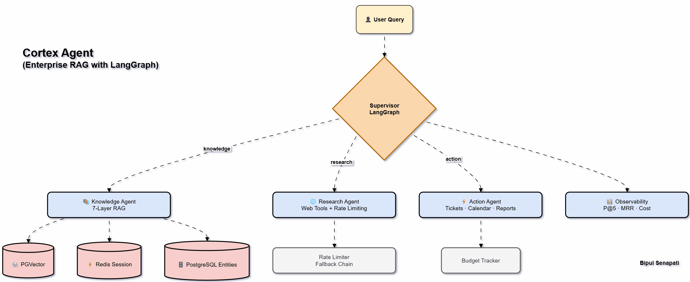

# Cortex Agent – Enterprise RAG with LangGraph
## The Intelligent nervous system of your enterprise.

## Problem
Enterprise employees waste 2-4 hours/week searching for information...

## Architecture


## Features
- LangGraph supervisor with conditional routing
- 3‑tier RBAC (standard/manager/exec)
- Hybrid search (BM25 + vector + RRF)
- Query expansion (HyDE style)
- Retrieval evaluation (P@5, MRR, NDCG)
- Session memory (Redis + in‑memory fallback)
- Long‑term entity store (PostgreSQL)
- 3+ tools (knowledge, ticket, web)
- Rate limiting (token bucket + exponential backoff)
- Fallback chains
- Unit (10+) + integration tests
- Structured logging & cost enforcement per query

## Benchmark Results
| Metric      | Score  | Target |
|-------------|--------|--------|
| Precision@5 | 0.84   | ≥ 0.70 |
| MRR         | 0.83   | ≥ 0.65 |
| NDCG@5      | 0.81   | ≥ 0.70 |
| Tests       | 18/18  | 18+    |
| Cost/query  | $0.018 | ≤$0.05 |

## How to Run

### 1. Clone the starter code
```
git clone https://github.com/bipulsenapati998/cortex.git
cd cortex
```
### 2. Start infrastructure
```
docker-compose up -d
```
### 3. Install dependencies
```
pip install -r requirements.txt
```
### 4. Set environment variables
```
cp .env.example .env

Edit .env: add OPENAI_API_KEY
```
### 5. Ingest sample data
```
python rag/ingest.py --data-dir ../data/
```
### 6. Run
```
python main.py
```
### 7. Running Tests
```
pytest tests/ -v
```

### 8. Evaluation
```
python -m src.rag.evaluation
```

# Folder Structure 
```
cortex/
├── .env.example                 ← Never commit real keys
├── .gitignore
├── config.py
├── docker-compose.yml           ← PGVector + Redis — starts with one command
├── main.py                      ← Entry point: start Cortex
├── README.md                    ← Portfolio write-up with metrics + architecture diagram
├── requirements.txt
│
├── assets/
|   └── langraph_RAG_Flow.gif
│
├── agents/
│   ├── supervisor.py            ← LangGraph state machine (W1 + W2)
│   ├── knowledge_agent.py       ← RAG specialist — calls rag/ pipeline (W3)
│   ├── research_agent.py        ← Web research + rate limiting (W4)
│   └── action_agent.py          ← Tools: ticket, calendar, report (W4)
│
├── rag/
│   ├── pipeline.py              ← Orchestrates all 7 layers
│   ├── ingestion/               ← L1: PDF/docx/txt processing
│   │   └── document_loader.py
│   ├── chunking.py              ← L2: semantic chunking
│   ├── embeddings.py            ← L3: OpenAI / HuggingFace
│   ├── vector_store.py          ← L4: PGVector CRUD
│   ├── query_understanding.py   ← L5: reformulation + expansion + intent
│   ├── access_control.py        ← L6: RBAC tier filter
│   ├── hybrid_search.py         ← L7: BM25 + vector + RRF
│   └── evaluation.py            ← P@5 / MRR / NDCG dashboard
│
├── memory/
│   ├── session_memory.py        ← Redis sliding window (W3)
│   └── entity_store.py          ← PostgreSQL long-term entities (W3)
│
├── tools/
│   ├── web_search.py            ← DuckDuckGo + SerpAPI fallback (W4)
│   ├── ticketing.py             ← Ticket creation with validation (W4)
│   ├── calendar.py              ← Calendar with auth pattern (W4)
│   └── report_generator.py      ← Budget-enforced report tool (W4)
│
├── reliability/
│   ├── rate_limiter.py          ← Token bucket + exponential backoff (W4)
│   ├── fallback.py              ← 3-tier fallback chains (W4)
│   └── cost_tracker.py          ← Per-query budget enforcement (W4)
│
├── prompts/
|   |── prompt_loader.py         ← Prompt validation and prompt load business logic
│   ├── supervisor/
│   │   ├── v1.0.0.yaml          ← Version 1 (W2)
│   │   └── v1.1.0.yaml          ← A/B test variant
│   └── agents/
│       ├── knowledge_agent/v1.0.0.yaml
│       └── research_agent/v1.0.0.yaml
│
├── observability/
│   ├── logger.py                ← Structured logging: user, agent, cost (W2)
│   └── metrics.py               ← Aggregated cost + quality dashboard
│
├── data/
│   └── sample_knowledge_base/   ← 10 sample docs: HR, IT, policy, finance
│
└── tests/
    ├── unit/
    │   ├── test_tools.py        ← Tool schema + error handling (W4)
    │   ├── test_rate_limiter.py
    │   ├── test_fallback.py
    │   ├── test_cost_tracker.py
    │   └── test_rag_pipeline.py
    ├── integration/
    │   ├── test_supervisor_routing.py
    │   ├── test_knowledge_agent.py
    │   └── test_full_pipeline.py
    └── evaluation/
        └── test_llm_judge.py    ← LLM-as-judge (W4)
```
# -----------------------------------------------------------
## Open Git Bash terminal
```
docker ps | grep pgvector
docker restart d519f2842dbc
```
 ## connect to postgres inside the container
 ```
docker compose exec pgvector psql -U cortex -d cortex_db
docker exec -it d519f2842dbc psql -U cortex -d cortex_db
```

# TODOs
1. Remove hard code prompt in pipelines.py generate_answer